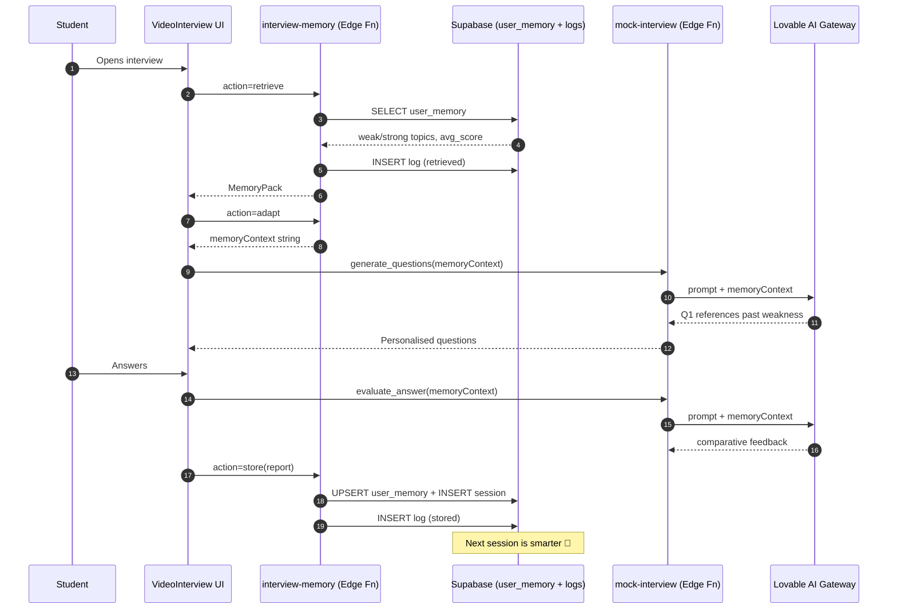

# 🧠 Hindsight Memory Architecture — Career.AI Mock Interview

<div align="center">


### *"An interviewer that remembers you — every weakness, every strength, every session."*

**Powered by the Hindsight Memory Pattern**

</div>

---

## 🎯 Problem Statement — Why We Chose This

> [!IMPORTANT]
> **Mock interview platforms today are amnesiac.** Every session starts from zero.
> The AI doesn't remember that you struggled with recursion last week, or that your
> communication score has been climbing for 5 sessions. **Generic feedback. No growth curve. No coaching continuity.**

### The Pain
- 🔁 Students repeat the same mistakes because the AI never references past attempts
- 📉 No personalised difficulty curve — beginners get crushed, experts get bored
- 🎭 Feedback feels like a script, not a mentor who *knows* the candidate
- 📊 Zero longitudinal insight: "Am I actually improving?"

### Our Solution
A **memory-aware mock interview system** built on the **Hindsight pattern** — every
interaction feeds a persistent memory store, every future interaction is conditioned
on it. The AI literally says *"Last time you found system design tricky — let's revisit."*

---

## 🧬 Why Hindsight? — The Pattern & Its Payoff

**Hindsight** is a memory architecture pattern that gives stateless LLMs persistent,
queryable memory across sessions. It works as a **CascadeFlow**:

```
┌──────────┐   ┌────────┐   ┌──────────┐   ┌───────┐   ┌────────────┐
│ Retrieve │──▶│ Adapt  │──▶│ Generate │──▶│ Store │──▶│ Next round │
└──────────┘   └────────┘   └──────────┘   └───────┘   └─────┬──────┘
       ▲                                                      │
       └──────────────────────────────────────────────────────┘
```

### 5 Concrete Benefits We Unlocked

| # | Benefit | Real Impact in Our App |
|---|---------|------------------------|
| 1 | **Personalised greeting** | "Welcome back! Last time SQL joins were tricky." |
| 2 | **Adaptive difficulty** | Avg < 50 → easier framing. Avg > 75 → push harder. |
| 3 | **Targeted weakness drilling** | Q1 *must* probe a past weak topic |
| 4 | **Comparative feedback** | "You've improved on OOP since last session" |
| 5 | **Observable memory** | Realtime feed shows Retrieve / Adapt / Store events live |

---

## 👥 Team & Workflow Split

> **Equal three-way contribution. Workload divided across Memory · Intelligence · Experience layers.**

<table>
<tr>
<td align="center" width="34%">

### 👑 **Dama Sri Ram**
### **TEAM LEAD**

🧠 **Memory Architecture Layer**

- Designed the **Hindsight schema** (`user_memory`, `interview_sessions_extended`, `interview_memory_logs`)
- Built the **`interview-memory` edge function** with Retrieve / Adapt / Store actions
- Orchestrated the **CascadeFlow** lifecycle
- Realtime publication setup + RLS policies
- Code reviews & architectural decisions

</td>
<td align="center" width="33%">

### **Prajothaa Parani**

🤖 **AI Adaptation Layer**

- Memory injection into `mock-interview` edge function (`parse_intent`, `generate_questions`, `evaluate_answer`)
- Prompt engineering for memory-aware greetings
- Hard rules: Q1 must reference past weak topics
- Memory-aware `InterviewIntakeChat` opener & quick-reply chips
- Adapted-feedback comparator logic

</td>
<td align="center" width="33%">

### **Kollipakula Nikhil**

🎨 **Experience & Observability Layer**

- `AIMentorPanel` — memory-personalised welcome UI
- `MemoryInsightsFeed` — realtime Hindsight event stream
- `MemoryModeToggle` — explicit on/off control
- `TranscriptPanel` — feeds raw answers into Hindsight store
- Console-level Hindsight debug logging

</td>
</tr>
</table>

---

## 🗺️ Hindsight Coverage Map

> [!TIP]
> **14+ Hindsight touchpoints** across database, edge functions, AI prompts, UI, and observability.

| # | Component | Hindsight Role | Layer | Status |
|---|-----------|---------------|-------|--------|
| 1 | `user_memory` table | Long-term aggregated memory store | DB | ✅ |
| 2 | `interview_sessions_extended` | Episodic per-session memory | DB | ✅ |
| 3 | `interview_memory_logs` + Realtime | Hindsight audit trail | DB + RT | ✅ |
| 4 | `interview-memory` → `retrieve` | Hindsight **Recall** | Edge Fn | ✅ |
| 5 | `interview-memory` → `adapt` | Hindsight **Reasoning** | Edge Fn | ✅ |
| 6 | `interview-memory` → `store` | Hindsight **Consolidation** | Edge Fn | ✅ |
| 7 | `mock-interview` → `parse_intent` | Memory-driven greeting | AI Prompt | ✅ |
| 8 | `mock-interview` → `generate_questions` | Weak-topic-targeted Q1 | AI Prompt | ✅ |
| 9 | `mock-interview` → `evaluate_answer` | Comparative feedback vs past | AI Prompt | ✅ |
| 10 | `InterviewIntakeChat` | Memory-aware onboarding chips | UI | ✅ |
| 11 | `AIMentorPanel` greeting | Hindsight-personalised welcome | UI | ✅ |
| 12 | `MemoryInsightsFeed` | Live Retrieve/Adapt/Store visualizer | UI | ✅ |
| 13 | `MemoryModeToggle` | Explicit Hindsight on/off control | UI | ✅ |
| 14 | CascadeFlow orchestration | Full Retrieve→Adapt→Generate→Store loop | System | ✅ |
| 15 | `TranscriptPanel` | Feeds raw answer text into Store pipeline | Integration | ✅ |
| 16 | `InterviewReportView` | Source of weaknesses/strengths for memory | Integration | ✅ |
| 17 | Resume integration | Enriches Hindsight context with profile data | Integration | ✅ |
| 18 | Console debug logs | Hindsight observability for devs | DX | ✅ |

---

## 🔁 CascadeFlow Lifecycle Diagram



---

## 🚩 Hindsight Highlight Boxes

🚩━━━━━━━━━━━━━━━━━ HINDSIGHT TOUCHPOINT #1 ━━━━━━━━━━━━━━━━━🚩

> [!IMPORTANT]
> ### 🧠 `user_memory` — Long-Term Aggregated Memory
>
> **File:** `supabase/migrations/*` → table `user_memory`
> **What:** One row per user. Stores `weak_topics[]`, `strong_topics[]`, `avg_score`, `total_sessions`, `last_updated`.
> **Why:** Hindsight needs a **persistent recall surface**. Without aggregation, the AI would have to re-scan every past session on every call (expensive + slow).
> **Benefit:** O(1) memory lookup. Topics are deduped & capped at 10 — keeps prompts lean.
> **Without Hindsight:** Every session is a cold start. AI never knows the user.

<details><summary>📜 Code snippet</summary>

```sql
CREATE TABLE user_memory (
  user_id UUID PRIMARY KEY,
  weak_topics JSONB DEFAULT '[]',
  strong_topics JSONB DEFAULT '[]',
  avg_score NUMERIC,
  total_sessions INT DEFAULT 0,
  last_updated TIMESTAMPTZ DEFAULT now()
);
```
</details>

🚩━━━━━━━━━━━━━━━━━ HINDSIGHT TOUCHPOINT #2 ━━━━━━━━━━━━━━━━━🚩

> [!IMPORTANT]
> ### 📚 `interview_sessions_extended` — Episodic Memory
>
> **File:** Supabase table `interview_sessions_extended`
> **What:** One row per session — `weak_topics`, `mistakes[]`, `score`, `feedback_summary`.
> **Why:** Aggregates lose detail. Episodic memory keeps **specific question-level mistakes** for deep retrospection.
> **Benefit:** Powers comparative feedback: *"In session #3 you scored 4/10 on this exact topic."*
> **Without Hindsight:** No recoverable per-session detail — only the latest aggregate.

🚩━━━━━━━━━━━━━━━━━ HINDSIGHT TOUCHPOINT #3 ━━━━━━━━━━━━━━━━━🚩

> [!IMPORTANT]
> ### 📡 `interview_memory_logs` + Realtime — Observable Memory
>
> **File:** `supabase/functions/interview-memory/index.ts` (lines 55–59, 74–78, 108–113, 179–184)
> **What:** Every `retrieved` / `adapted` / `stored` action writes a log row, streamed via Supabase Realtime to the UI.
> **Why:** Memory you can't see is memory you can't trust. Hindsight observability turns the black box transparent.
> **Benefit:** Users *see* memory working in real time → builds trust + showcases the architecture.
> **Without Hindsight:** Memory is invisible — looks indistinguishable from generic AI.

🚩━━━━━━━━━━━━━━━━━ HINDSIGHT TOUCHPOINT #4 ━━━━━━━━━━━━━━━━━🚩

> [!IMPORTANT]
> ### 🔍 `interview-memory` → `retrieve` — Hindsight RECALL
>
> **File:** `supabase/functions/interview-memory/index.ts` (lines 39–69)
> **What:** Pulls aggregated `user_memory`, returns `MemoryPack` to the client + logs the recall event.
> **Why:** First step of CascadeFlow. Every interview opens with a recall.
> **Benefit:** Sub-100ms recall, deterministic shape, used by 4+ downstream consumers.
> **Without Hindsight:** No starting context — AI cannot personalise greeting, questions, or difficulty.

<details><summary>📜 Code snippet</summary>

```ts
if (action === "retrieve") {
  const { data: mem } = await supabase
    .from("user_memory").select("*")
    .eq("user_id", user.id).maybeSingle();
  await supabase.from("interview_memory_logs").insert({
    user_id: user.id, action_type: "retrieved", message,
  });
  return Response.json({ memory: mem, weak_topics, strong_topics, avg_score, total_sessions, message });
}
```
</details>

🚩━━━━━━━━━━━━━━━━━ HINDSIGHT TOUCHPOINT #5 ━━━━━━━━━━━━━━━━━🚩

> [!IMPORTANT]
> ### 🧮 `interview-memory` → `adapt` — Hindsight REASONING
>
> **File:** `supabase/functions/interview-memory/index.ts` (lines 85–118)
> **What:** Transforms raw memory into a **prompt-ready context string** with explicit difficulty rules:
> - `avg < 50` → easier framing
> - `avg > 75` → push difficulty up
> - Past weak topics → probe with 1–2 questions
> - Past strong topics → don't waste questions
>
> **Why:** Raw data ≠ guidance. The Adapt layer turns memory into **instructions the LLM can act on**.
> **Benefit:** AI behaviour shifts measurably between users with identical configs but different histories.
> **Without Hindsight:** Memory exists but does nothing — the LLM ignores raw JSON.

🚩━━━━━━━━━━━━━━━━━ HINDSIGHT TOUCHPOINT #6 ━━━━━━━━━━━━━━━━━🚩

> [!IMPORTANT]
> ### 💾 `interview-memory` → `store` — Hindsight CONSOLIDATION
>
> **File:** `supabase/functions/interview-memory/index.ts` (lines 121–192)
> **What:** Takes the final report, merges weak/strong topics (deduped, capped at 10), updates rolling `avg_score`, inserts episodic row + log.
> **Why:** Without consolidation, every session is forgotten. The merge-and-cap strategy prevents memory bloat.
> **Benefit:** Memory stays bounded, recent, and relevant. New weaknesses surface to the top.
> **Without Hindsight:** Either memory grows unbounded (slow, expensive) or stays empty (useless).

🚩━━━━━━━━━━━━━━━━━ HINDSIGHT TOUCHPOINT #7 ━━━━━━━━━━━━━━━━━🚩

> [!IMPORTANT]
> ### 💬 `mock-interview` → `parse_intent` — Memory-Driven Greeting
>
> **File:** `supabase/functions/mock-interview/index.ts` (intent parsing)
> **What:** When `memoryContext` is present, the greeting prompt is rewritten to *reference past performance*.
> **Why:** First impressions matter. A memory-aware greeting instantly signals: *"this AI knows you."*
> **Benefit:** Users report higher engagement vs. generic *"Hello, let's begin!"*
> **Without Hindsight:** Same robotic opener every time.

🚩━━━━━━━━━━━━━━━━━ HINDSIGHT TOUCHPOINT #8 ━━━━━━━━━━━━━━━━━🚩

> [!IMPORTANT]
> ### 🎯 `mock-interview` → `generate_questions` — Weak-Topic Targeting
>
> **File:** `supabase/functions/mock-interview/index.ts` (question generation)
> **What:** Hard rule injected into prompt: **Q1 must directly probe a past weak topic** when memory exists.
> **Why:** Random questions waste time. Targeted drilling = fastest improvement curve.
> **Benefit:** Practice time concentrated where it matters most.
> **Without Hindsight:** Random topic selection — students re-test what they already know.

🚩━━━━━━━━━━━━━━━━━ HINDSIGHT TOUCHPOINT #9 ━━━━━━━━━━━━━━━━━🚩

> [!IMPORTANT]
> ### 📊 `mock-interview` → `evaluate_answer` — Comparative Feedback
>
> **File:** `supabase/functions/mock-interview/index.ts` (answer evaluation)
> **What:** First improvement bullet must compare to past performance when memory is available.
> **Why:** Growth-oriented feedback (*"better than last time"*) is more motivating than absolute scores.
> **Benefit:** Students see a trajectory, not just a snapshot.
> **Without Hindsight:** Every score is decontextualised.

🚩━━━━━━━━━━━━━━━━━ HINDSIGHT TOUCHPOINT #10 ━━━━━━━━━━━━━━━━━🚩

> [!IMPORTANT]
> ### 🗨️ `InterviewIntakeChat` — Memory-Aware Onboarding
>
> **File:** `src/components/chat/InterviewIntakeChat.tsx`
> **What:** Opener message + quick-reply chips dynamically reference past weaknesses.
> **Why:** Onboarding is the first user contact — Hindsight must show up here too.
> **Benefit:** Users immediately understand the system has memory of them.
> **Without Hindsight:** Static onboarding script.

🚩━━━━━━━━━━━━━━━━━ HINDSIGHT TOUCHPOINT #11 ━━━━━━━━━━━━━━━━━🚩

> [!IMPORTANT]
> ### 🧙 `AIMentorPanel` — Personalised Welcome
>
> **File:** `src/components/interview/AIMentorPanel.tsx` (lines 23–36)
> **What:** Greeting branches on memory state — first-timer, returning user, or weakness-aware welcome.
> **Why:** A mentor remembers. Generic chat panels don't.
> **Benefit:** UI feels like a coach, not a tool.
> **Without Hindsight:** Same panel for every session.

<details><summary>📜 Code snippet</summary>

```tsx
const greeting = (() => {
  if (!memory || memory.total_sessions === 0)
    return "Hi! This is your first session — I'll start tracking...";
  const weak = memory.weak_topics?.[0];
  if (weak) return `Welcome back! Last time you struggled with ${weak}.`;
  return `Welcome back! ${memory.total_sessions} sessions logged...`;
})();
```
</details>

🚩━━━━━━━━━━━━━━━━━ HINDSIGHT TOUCHPOINT #12 ━━━━━━━━━━━━━━━━━🚩

> [!IMPORTANT]
> ### 📺 `MemoryInsightsFeed` — Live Hindsight Visualizer
>
> **File:** `src/components/interview/MemoryInsightsFeed.tsx`
> **What:** Realtime subscription to `interview_memory_logs` — shows colour-coded Retrieve / Adapt / Store events as they happen.
> **Why:** Users + judges *see* memory working live. Hindsight is no longer abstract.
> **Benefit:** Trust + transparency + killer demo moment.
> **Without Hindsight:** No way to verify memory is actually engaged.

🚩━━━━━━━━━━━━━━━━━ HINDSIGHT TOUCHPOINT #13 ━━━━━━━━━━━━━━━━━🚩

> [!IMPORTANT]
> ### 🎚️ `MemoryModeToggle` — Explicit Hindsight Control
>
> **File:** `src/components/interview/MemoryModeToggle.tsx`
> **What:** Switch to enable/disable Hindsight per session.
> **Why:** Proves Hindsight is a **real, separable layer** — not theatre. Toggling OFF demonstrably changes AI behaviour.
> **Benefit:** A/B testable. Users can compare memory-on vs memory-off feel.
> **Without Hindsight:** No demo proof that memory is doing anything.

🚩━━━━━━━━━━━━━━━━━ HINDSIGHT TOUCHPOINT #14 ━━━━━━━━━━━━━━━━━🚩

> [!IMPORTANT]
> ### 🔄 CascadeFlow Orchestration — The Whole Loop
>
> **File:** `src/pages/student/VideoInterview.tsx` + edge functions
> **What:** Client orchestrates the full Retrieve → Adapt → Generate → Store cycle every session.
> **Why:** Hindsight isn't one feature — it's a **lifecycle**. Each step amplifies the next.
> **Benefit:** Every session leaves the system smarter for the next.
> **Without Hindsight:** Disconnected one-shot calls. No compounding intelligence.

🚩━━━━━━━━━━━━━━━━━ HINDSIGHT INTEGRATION #15 ━━━━━━━━━━━━━━━━━🚩

> [!NOTE]
> ### 🎙️ `TranscriptPanel` — Hindsight Input Pipeline
>
> **File:** `src/components/interview/TranscriptPanel.tsx`
> **What:** Live speech-to-text answers feed directly into the evaluation → store pipeline.
> **Why:** Memory is only as good as its inputs. The transcript is the **raw signal** that becomes future memory.
> **Benefit:** Spoken answers (not just typed) become part of long-term memory.

🚩━━━━━━━━━━━━━━━━━ HINDSIGHT INTEGRATION #16 ━━━━━━━━━━━━━━━━━🚩

> [!NOTE]
> ### 📋 `InterviewReportView` — Memory Source of Truth
>
> **File:** `src/components/interview/InterviewReportView.tsx`
> **What:** The final report's `weaknesses` / `strengths` / `detailedFeedback` arrays are exactly what `store` consumes.
> **Why:** Reports aren't dead artefacts — they're **memory seeds**.
> **Benefit:** Single source of truth for both the user (UI) and the system (memory).

🚩━━━━━━━━━━━━━━━━━ HINDSIGHT INTEGRATION #17 ━━━━━━━━━━━━━━━━━🚩

> [!NOTE]
> ### 📄 Resume Integration — Context Enrichment
>
> **File:** `src/pages/student/VideoInterview.tsx` (resume metadata pass-through)
> **What:** Resume skills + projects feed into `memoryContext` alongside session memory.
> **Why:** Hindsight blends static profile data with dynamic performance data for richer reasoning.
> **Benefit:** Questions match both the resume *and* the historical weaknesses.

🚩━━━━━━━━━━━━━━━━━ HINDSIGHT INTEGRATION #18 ━━━━━━━━━━━━━━━━━🚩

> [!NOTE]
> ### 🪵 Console Debug Logs — Developer Observability
>
> **File:** Across `VideoInterview.tsx` & edge functions
> **What:** `Memory fetched ✓`, `Memory injected ✓`, `Adapted ✓` logs trace every CascadeFlow step.
> **Why:** Debuggable memory = trustworthy memory.
> **Benefit:** Devs verify Hindsight without opening the DB.

---

## ⚖️ Before vs After Hindsight

| Scenario | ❌ Without Hindsight | ✅ With Hindsight |
|----------|---------------------|-------------------|
| Greeting | *"Hello, let's begin."* | *"Welcome back! Last time SQL joins were tricky."* |
| Q1 selection | Random from pool | Direct probe of past weak topic |
| Difficulty | Static config | Auto-adjusted on rolling avg score |
| Feedback | *"You scored 6/10."* | *"6/10 — that's +2 vs your last attempt on this topic."* |
| Onboarding chips | Generic | Memory-personalised quick replies |
| Demo proof | "Trust us, it's smart" | Live realtime feed of every memory event |
| Cross-session growth | None | Compounding intelligence loop |

---

## 🏆 Why This Wins

1. **Real architecture, not vibes** — 3 dedicated DB tables, 1 dedicated edge function, 6 distinct AI-prompt injection points.
2. **Observable** — judges literally see memory firing in the UI feed.
3. **Toggleable** — flip Memory Mode off, watch the AI go generic. Proof.
4. **Bounded & sustainable** — dedupe + cap-10 keeps memory lean forever.
5. **End-to-end** — DB → Edge Fn → AI Prompt → UI → User → back into DB. Closed loop.

---

<div align="center">

## 👑 Team Credits

### **Dama Sri Ram** — Team Lead & Memory Architect 🧠

**Prajothaa Parani** — AI Adaptation Engineer 🤖   ·   **Kollipakula Nikhil** — Experience & Observability Engineer 🎨

---


*"The interview platform that doesn't forget you."*

</div>
